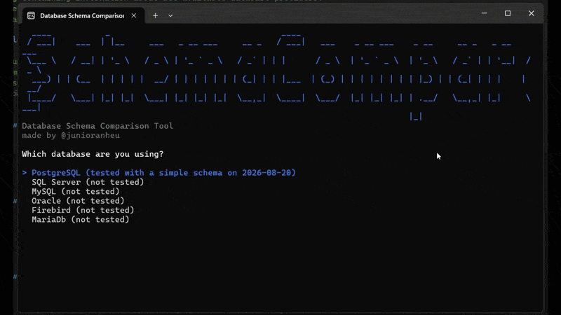

# SchemaCompare

[](https://dotnet.microsoft.com/)

[](https://github.com/junioranheu/schema-compare)


> 💡 **Under active development** - SchemaCompare is actively being developed and is not yet production-ready (at leat not completely).

| Component | Status | Real scenario test date |
|-----------|--------|----------------|
| Core Engine | ✅ Functional | - |
| CLI Interface | ✅ Functional | - |
| PostgreSQL | ✅ Tested | 2026-08-20 |
| SQL Server | ⚠️ Untested | - |
| MySQL | ⚠️ Untested | - |
| MariaDB | ⚠️ Untested | - |
| SQLite | ⚠️ Untested | - |
| Firebird | ⚠️ Untested | - |
| Oracle | ❌ Discontinued | - |

---

## ✨ Features

SchemaCompare identifies all structural differences between two databases:

### Tables
- ✅ Added tables
- ✅ Removed tables
- ✅ Modified table properties

### Columns
- ✅ Added columns
- ✅ Removed columns
- ✅ Data type changes
- ✅ Nullability changes
- ✅ Max length changes
- ✅ Precision and scale changes (numerics)

### Output
- ✅ Detailed visual comparison in the console
- ✅ SQL script generation for synchronization
- ✅ Multi-database provider support

---


## 👀 Preview



> ⚠️ The connection strings shown in this preview have been deleted and were used for testing purposes only.

---

## 💾 Supported providers

SchemaCompare currently supports the following database providers:

| Provider | Status | Unit Tests
|----------|--------|------------------|
| **PostgreSQL** | ✅ Tested | Yes | Yes (2026-08-20) |
| **SQL Server** | ⚠️ Implemented | Yes | No |
| **MySQL** | ⚠️ Implemented | Yes | No |
| **MariaDB** | ⚠️ Implemented | Yes | No |
| **SQLite** | ⚠️ Implemented | Yes | No |
| **Firebird** | ⚠️ Implemented | Yes | No |
| **Oracle** | ❌ Discontinued | - | - |

> 💡 **Note**: While all providers have unit tests, currently only PostgreSQL has been tested with real data. Feedback and contributions to help test other providers are highly welcome!

---

## 🚀 Getting started

### Prerequisites

- **.NET 10 SDK** or higher
- Access to two databases for comparison
- Valid **connection strings** for each database

### Installation

#### Option 1: Clone and build

```bash
git clone https://github.com/junioranheu/schema-compare.git
cd schema-compare
dotnet build
```

#### Option 2: Run directly from the build folder

```bash
cd SchemaCompare.Cli
dotnet run
```

### Basic Usage

1. **Run the application**:
   ```bash
   dotnet run --project SchemaCompare.Cli
   ```

2. **Select the database provider**:
   ```text
   Which database are you using?
   ❯ PostgreSQL (tested on 2026-08-20)
     SQL Server (not tested)
     MySQL (not tested)
     ...
   ```

3. **Enter the source database information**:
   ```text
   Source database name [e.g development]: production
   Connection string for production: Server=localhost;Database=prod_db;...
   ```

4. **Enter the target database information**:
   ```text
   Target database name [e.g development]: staging
   Connection string for staging: Server=localhost;Database=staging_db;...
   ```

5. **Confirm the comparison**:
   ```text
   Do you want to proceed? [y/n]: y
   ```

6. **Review the results** and optionally generate SQL synchronization scripts.

---

## 🏗️ Architecture

SchemaCompare uses a **provider-based architecture** with a clear separation of concerns:

```text
┌─────────────────────────────────────────────────────────┐
│             SchemaCompare.Cli (CLI)                     │
│         ┌──────────────────────────────┐                │
│         │  ConsoleInteractionService   │                │
│         │  SchemaComparisonService     │                │
│         │  SqlScriptExportService      │                │
│         └──────────────────────────────┘                │
└────────────────────┬────────────────────────────────────┘
                     │
         ┌───────────┴───────────┐
         │                       │
┌────────▼────────────┐  ┌──────▼──────────────┐
│ SchemaCompare.Core  │  │  Schema Readers     │
├─────────────────────┤  ├─────────────────────┤
│ • DiffEngine        │  │ • PostgresReader    │
│ • Comparison        │  │ • SqlServerReader   │
│ • Common Model      │  │ • MySqlReader       │
│ • SQL Generation    │  │ • FirebirdReader    │
│                     │  │ • SQLiteReader      │
└─────────────────────┘  │ • MariaDbReader     │
                         └─────────────────────┘
                                  │
                    ┌─────────────┴─────────────┐
                    │                           │
            ┌───────▼────────┐         ┌───────▼────────┐
            │ Source         │         │ Target         │
            │ Database       │         │ Database       │
            └────────────────┘         └────────────────┘
```

### Core components

- **SchemaCompare.Core**: Provider-agnostic comparison logic
  - `IDiffEngine`: Interface for schema comparison
  - `ISchemaReader`: Interface implemented by each provider
  - Common data models for tables and columns

- **SchemaCompare.Cli**: Command-line user interface
  - User interactions (provider selection, data input)
  - Comparison flow coordination
  - Formatted results display

- **Providers**: Database-specific implementations
  - Each provider implements `ISchemaReader`
  - Database-specific SQL queries
  - Maps the specific schema to the common model

---

## 🔍 How it works

### Execution flow

1. **Provider selection**: The user chooses which database type to use.
2. **Schema reading**: 
   - Connects to the databases (source and target).
   - Reads table and column metadata.
   - Maps them to the common schema model.
3. **Comparison**:
   - Compares structures using the `DiffEngine`.
   - Identifies added, removed, or modified tables/columns.
   - Generates a result containing all the differences.
4. **Result display**: Outputs the differences in a human-readable format to the console.
5. **Script generation (optional)**:
   - If differences are found, prompts to generate SQL scripts.
   - These scripts can be used to synchronize the databases.

### Common data model

Each provider maps its specific schema to this model:

```csharp
public record DatabaseSchema
{
    public string Name { get; init; }
    public IReadOnlyCollection<TableSchema> Tables { get; init; }
}

public record TableSchema
{
    public string Name { get; init; }
    public IReadOnlyCollection<ColumnSchema> Columns { get; init; }
}

public record ColumnSchema
{
    public string Name { get; init; }
    public string DataType { get; init; }
    public bool IsNullable { get; init; }
    public int? MaxLength { get; init; }
    public int? Precision { get; init; }
    public int? Scale { get; init; }
}
```

---

## 📌 Examples

### Example 1: Basic comparison

```bash
# Run the tool
dotnet run --project SchemaCompare.Cli

# Select PostgreSQL
# Enter: production (source)
# Enter: Connection string for production
# Enter: staging (target)
# Enter: Connection string for staging
# Confirm: y

# Expected output:
# ✅ 5 identical tables
# ⚠️ 2 tables with differences
#   - Column 'created_at' removed from 'users'
#   - Type of 'email' changed from VARCHAR(100) to VARCHAR(255)
```

### Example 2: Identified differences

If differences exist, the output will look like this:

```text
ADDED TABLES
├─ table_2026

REMOVED TABLES
├─ old_table

MODIFIED TABLES
├─ users
│  ├─ ADDED COLUMNS
│  │  └─ updated_at (TIMESTAMP)
│  └─ MODIFIED COLUMNS
│     └─ email (VARCHAR(100) → VARCHAR(255))
```

---

## 🧪 Testing

The project includes comprehensive unit tests:

```bash
# Run all tests
dotnet test

# Run tests for a specific provider
dotnet test --filter "PostgreSQL"

# Run with code coverage
dotnet test /p:CollectCoverage=true
```

### Current status

- ✅ **Unit Tests**: Implemented for all providers.
- ✅ **PostgreSQL**: Tested with real data (2026-08-20).
- ⚠️ **Others**: Need to be tested in real-world environments.

---

## 🤝 Contributing

Contributions are highly welcome! This is an open-source project, and any help is appreciated.

### How to contribute

1. **Fork** the repository
2. **Create a branch** for your feature (`git checkout -b feature/AmazingFeature`)
3. **Commit** your changes (`git commit -m 'Add some AmazingFeature'`)
4. **Push** to the branch (`git push origin feature/AmazingFeature`)
5. **Open a Pull Request**

---

## 👨‍💻 Author

Developed by **[@junioranheu](https://github.com/junioranheu)**
